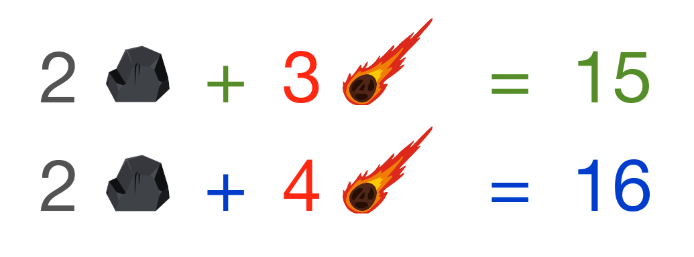
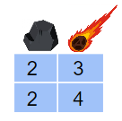

**1.** You are an astronaut on a mission to planet Mars. Using two robotic spacecraft, the Perseverance and Curiosity rovers, your mission is to collect rock samples to bring back to Earth to determine if there is life on the red planet. As a trained astronaut, you know that each rover has a weight limit for samples.

You split the rocks between the two rovers. You first place 2 basalt samples (volcanic rock) and 3 meteorite rocks to Perseverance that weigh 15 grams in total.

You then put 2 basalt samples and 4 meteorites to Curiosity that weigh 16 grams in total. Your goal is to determine how much each sample weighs (b for basalt, m for meteorite). You know that the collected samples are all the same size and shape, so all basalt samples will have the same weight, just as all meteorite samples will have identical weight. 

To help you calculate the weight of each rock sample, your spacecraft user interface requires you to input the system of equations that represents the weights of the samples on each one of the rovers. 

**Which of the following systems of equations do you input?**
- [ ] (A)

$$\begin{cases} 2b + 3m = 15 \cr 2b + 4m = 16 \end{cases}$$
- [ ] (B)

$$\begin{cases} 3b + 2m = 15 \cr 4b + 2m = 16 \end{cases}$$
- [ ] (C)

$$\begin{cases} 5b + 2m = 25 \cr 6b + 7m = 19 \end{cases}$$
- [ ] (D)

$$\begin{cases} 2b + 3m = 16 \cr 2b + 4m = 15 \end{cases}$$

**2. Which of the following matrices represents the system of equations?**

- [ ] (A)

$$\begin{bmatrix} 2 & 3 \cr 2 & 4 \end{bmatrix}$$
- [ ] (B)

$$\begin{bmatrix} 3 & 15 \cr 4 & 16 \end{bmatrix}$$
- [ ] (C)

$$\begin{bmatrix} 2 & 2 \cr 3 & 4 \end{bmatrix}$$
- [ ] (D)

$$\begin{bmatrix} 2 & 3 \cr 0 & 0 \end{bmatrix}$$

**3. Calculate the determinant of the matrix. Is the matrix singular or non-singular?**

The image above represents the following matrix:

$$\begin{bmatrix} 2 & 3 \cr 2 & 4 \end{bmatrix}$$

Where the first column represents the rocks and the second column represents the meteorites.

Hint:To find the determinant apply the formula [ad-bc]. A matrix of determinant 0 is singular, while a determinant different than 0 represents a complete system, thus a non-singular matrix.
- [ ] 2, Singular
- [ ] 2, Non-singular
- [ ] 0, Singular
- [ ] -2, Singular

**4. Determine if the above matrix has linearly dependent or independent rows.**
- [ ] Linearly independent
- [ ] Linearly dependent
- [ ] It cannot be determined

**5. How much does each rock sample weigh?**

Hint: Solve the system of equations to determine the weight of each rock sample. 
- [ ] basalt = 2g, meteorite = 1g
- [ ] basalt = 1g, meteorite = 2g
- [ ] basalt = 6g, meteorite = 1g
- [ ] basalt = 1g, meteorite = 6g
